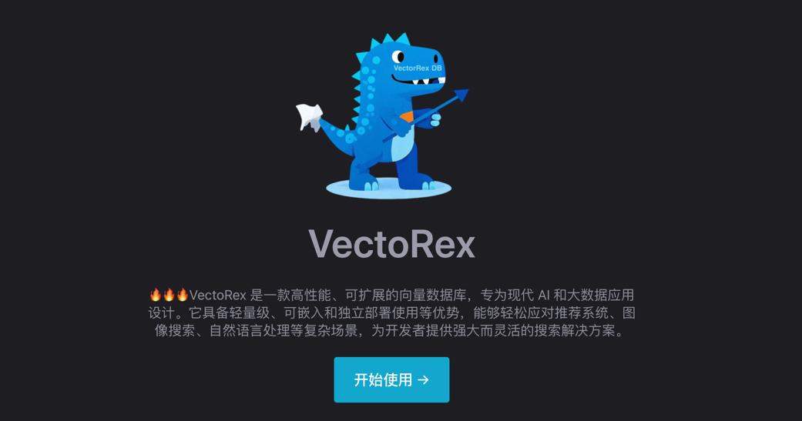
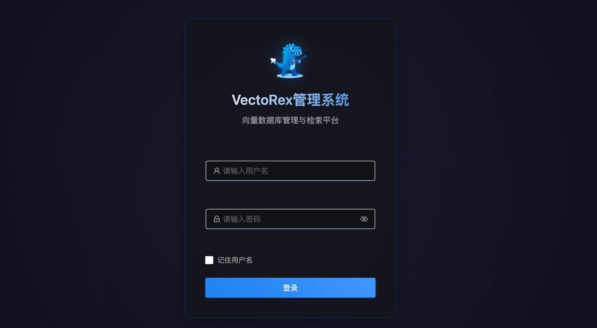

# **[VectoRex](https://vectorex-doc.m78cloud.cn/)**


<div style="display: inline-block; border: 4px solid #ccc; border-radius: 10px; box-shadow: 0 4px 8px rgba(0, 0, 0, 0.1); margin: 10px; padding: 10px;">
  
</div>

## **简介**

**VectoRex** 是一款高性能、可扩展的向量数据库，专为现代 AI 和大数据应用设计。它具备轻量级、可嵌入和独立部署使用等优势，能够轻松应对推荐系统、图像搜索、自然语言处理等复杂场景，为开发者提供强大而灵活的搜索解决方案。

### 核心优势

- **轻量级**：无需依赖复杂的外部库，核心功能全部由 Java 实现，易于集成和部署，跨平台兼容，真正实现“一次编写，到处运行”。
- **可嵌入**：提供 starter、solon-plugin,引包即用，可快速集成到现有系统，无缝融入各类应用架构。
- **独立部署**：支持独立部署的检索服务，具备完整的功能体系，可通过 RESTful API 接口方便地与客户端进行交互，满足不同场景下的使用需求。
- **SDK**：: 提供 Java、Golang、Python 客户端 SDK，支持与 VectoRex 服务的交互，为开发者提供便捷的集成体验。

---

## **为什么选择 VectoRex？**

### **技术特点**

- **高性能搜索**：基于先进的 HNSW 算法，支持大规模向量的快速搜索，为用户提供高效的近似最近邻搜索（ANN）体验。
- **混合查询**：巧妙融合向量搜索与标量过滤，支持复杂的查询场景，如查找与某张图片最相似的图片且图片标签为“风景”，或查找与某段文本最相似的文档且发布时间在最近一周内。
- **持久化存储**：内置高效的数据存储机制，确保大规模数据集的存储安全与快速恢复，保障数据的完整性和可靠性。
- **灵活的索引管理**：涵盖标量索引（倒排索引、范围索引）和向量索引，支持动态添加、删除和更新向量数据，满足多样化的索引需求。

### **使用便捷性**

- **vectorex-starter**：作为 Spring Boot Starter，它提供了自动配置和便捷的 API，帮助开发者在 Spring Boot 应用中轻松集成 VectoRex 功能。通过 Maven 引入 VectoRex 时，只需添加以下依赖：
  ```xml
  <dependency>
      <groupId>io.github.javpower</groupId>
      <artifactId>vectorex-starter</artifactId>
      <version>1.5.1</version>
  </dependency>
  ```
- **vectorex-solon-plugin**：作为 solon 插件，它提供了自动配置和便捷的 API，帮助开发者在 Solon 应用中轻松集成 VectoRex 功能。通过 Maven 引入 VectoRex 时，只需添加以下依赖：
  ```xml
  <dependency>
      <groupId>io.github.javpower</groupId>
      <artifactId>vectorex-solon-plugin</artifactId>
      <version>1.5.1</version>
  </dependency>
  ```  
- **vectorex-server**：作为一个独立部署的检索服务，具备创建集合、添加数据、查询数据等完整功能，为用户提供灵活的部署选项。
  ```sh
   docker run -d -p 8080:8382 --name vectorrex-server javpower/vectorex-server:v1.0.0
   ```
   
- **vectorex-client**：作为 Java 客户端 SDK，提供了与 VectoRex 服务交互的丰富接口，包括创建集合、添加数据、查询数据等，助力开发者便捷地在应用中集成 VectoRex 服务。通过 Maven 引入 VectoRex 客户端时，只需添加以下依赖：
  ```xml
  <dependency>
      <groupId>io.github.javpower</groupId>
      <artifactId>vectorex-client</artifactId>
      <version>1.5.1</version>
  </dependency>
  ```
- **vectorex-client-go**：作为 Go 客户端 SDK，提供了与 VectoRex 服务交互的丰富接口，包括创建集合、添加数据、查询数据等功能。通过 Go Modules 引入 VectoRex 客户端时，只需运行以下命令：
  ```bash
   go get gitee.com/javpower/VectoRex/vectorex-client-go
  ```
  ```bash
   go get github.com/javpower/VectoRex/vectorex-client-go
  ```
---

## **性能 benchmark**

- **待补充**

---

## **应用场景**

- **推荐系统**：精准定位与用户兴趣高度匹配的内容，提升推荐效果和用户体验。
- **图像搜索**：基于图像特征的相似性搜索，快速找到与目标图像相似的图片资源。
- **自然语言处理**：实现语义搜索和文本相似度计算，助力自然语言处理相关应用的高效运行。
- **生物信息学**：应用于基因序列比对和蛋白质结构搜索，为生物信息学研究提供有力支持。

---


## **友情链接**

以下是一些与项目相关的推荐资源或合作伙伴：

| 名称              | 描述                                  | 链接                                             |
|-----------------|-------------------------------------|------------------------------------------------|
| **VectoRex**    | VectoRex 项目的官方文档，包含详细的使用指南和 API 参考。 | [查看文档](https://vectorex-doc.m78cloud.cn/)      |
| **ImageRex**    | 基于VectoRex 的以图搜图系统                  | [查看文档](https://gitee.com/giteeClass/ImageRex/) |
| **MilvusPlus**  | Milvus向量数据库增强操作库                    | [查看文档](https://milvus-plus.dromara.org/)       |
| **Dante Cloud** | “一套代码、两种架构”的企业级多租户微服务系统             | [查看文档](https://www.herodotus.cn)               |
| **Warm-Flow**   | 国产工作流引擎🎉，简洁轻量，jar包快速引入设计器          | [查看文档](https://warm-flow.dromara.org/)         |
| **Skyeye云**     | 集成OA、CRM、ERP、MES、PM、行政等为一体智能制造软件。   | [查看文档](https://gitee.com/dromara/skyeye)       |

---

---

## **许可证**

VectoRex 基于 **Apache License 2.0** 开源。详情请参阅 [LICENSE](LICENSE) 文件。

---

## **联系我们**

- **邮箱**：javpower@163.com
---