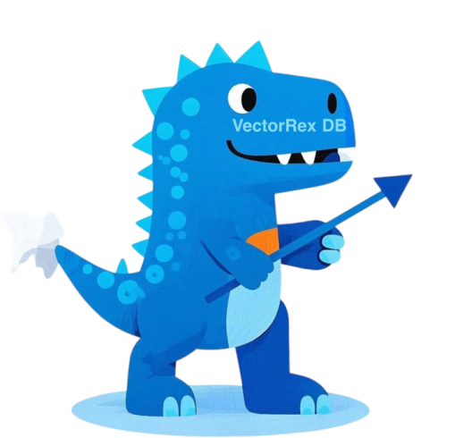

# **VectoRex**

**A High-Performance Vector Database Implemented in Pure Java**

<div style="display: inline-block; border: 4px solid #ccc; border-radius: 10px; box-shadow: 0 4px 8px rgba(0, 0, 0, 0.1); margin: 10px; padding: 10px;">
  
</div>

## **Introduction**

**VectoRex** is a high-performance, scalable vector database designed for modern AI and big data applications. It offers lightweight, embeddable, and standalone deployment options, making it ideal for complex scenarios such as recommendation systems, image search, and natural language processing. VectoRex provides developers with a powerful and flexible search solution.

### **Core Advantages**

- **Lightweight**: No dependency on complex external libraries. Core functionalities are entirely implemented in Java, making it easy to integrate and deploy across platforms, truly embodying "write once, run anywhere."
- **Embeddable**: Provides starter and solon-plugin packages for quick integration into existing systems, seamlessly fitting into various application architectures.
- **Standalone Deployment**: Supports standalone deployment as a retrieval service with a complete functional system, offering RESTful API interfaces for easy client interaction, catering to diverse usage scenarios.
- **SDK**: Provides Java, Golang, and Python client SDKs for interacting with VectoRex services, offering developers a convenient integration experience.

---

## **Why Choose VectoRex?**

### **Technical Features**

- **High-Performance Search**: Based on the advanced HNSW algorithm, it supports fast search of large-scale vectors, providing users with an efficient Approximate Nearest Neighbor (ANN) search experience.
- **Hybrid Query**: Intelligently combines vector search with scalar filtering, supporting complex query scenarios such as finding images most similar to a given image with the tag "landscape" or documents most similar to a given text published within the last week.
- **Persistent Storage**: Built-in efficient data storage mechanisms ensure the safety and quick recovery of large-scale datasets, guaranteeing data integrity and reliability.
- **Flexible Index Management**: Covers scalar indexes (inverted index, range index) and vector indexes, supporting dynamic addition, deletion, and updating of vector data to meet diverse indexing needs.

### **Ease of Use**

- **vectorex-starter**: As a Spring Boot Starter, it provides auto-configuration and convenient APIs, helping developers easily integrate VectoRex functionalities into Spring Boot applications. To include VectoRex via Maven, simply add the following dependency:
  ```xml
  <dependency>
      <groupId>io.github.javpower</groupId>
      <artifactId>vectorex-starter</artifactId>
      <version>1.3.0</version>
  </dependency>
  ```
- **vectorex-solon-plugin**: As a Solon plugin, it provides auto-configuration and convenient APIs, helping developers easily integrate VectoRex functionalities into Solon applications. To include VectoRex via Maven, simply add the following dependency:
  ```xml
  <dependency>
      <groupId>io.github.javpower</groupId>
      <artifactId>vectorex-solon-plugin</artifactId>
      <version>1.3.0</version>
  </dependency>
  ```  
- **vectorex-server**: As a standalone retrieval service, it offers complete functionalities such as creating collections, adding data, and querying data, providing flexible deployment options.
  ```sh
   docker run -d -p 8080:8382 --name vectorrex-server javpower/vectorex-server:v1.0.0
   ```
- **vectorex-client**: As a Java client SDK, it provides rich interfaces for interacting with VectoRex services, including creating collections, adding data, and querying data, helping developers easily integrate VectoRex services into their applications. To include VectoRex client via Maven, simply add the following dependency:
  ```xml
  <dependency>
      <groupId>io.github.javpower</groupId>
      <artifactId>vectorrex-client</artifactId>
      <version>1.3.0</version>
  </dependency>
  ```
- **vectorex-client-go**: As a Go client SDK, it provides rich interfaces for interacting with VectoRex services, including creating collections, adding data, and querying data. To include VectoRex client via Go Modules, simply run the following command:
  ```bash
   go get gitee.com/javpower/VectoRex/vectorex-client-go
   go get github.com/javpower/VectoRex/vectorex-client-go
  ```
---

## **Performance Benchmark**

- **To be added**

---

## **Application Scenarios**

- **Recommendation Systems**: Accurately locate content that highly matches user interests, improving recommendation effectiveness and user experience.
- **Image Search**: Perform similarity searches based on image features to quickly find images similar to the target image.
- **Natural Language Processing**: Enable semantic search and text similarity calculations, supporting the efficient operation of natural language processing applications.
- **Bioinformatics**: Apply to gene sequence alignment and protein structure search, providing strong support for bioinformatics research.

---

## **Friendly Links**

Here are some recommended resources or partners related to the project:

| Name              | Description                                  | Link                                             |
|-----------------|-------------------------------------|------------------------------------------------|
| **VectoRex**    | Official documentation for the VectoRex project, including detailed usage guides and API references. | [View Documentation](https://vectorex-doc.m78cloud.cn/)      |
| **ImageRex**    | An image search system based on VectoRex.                  | [View Documentation](https://gitee.com/giteeClass/ImageRex/) |
| **MilvusPlus**  | An enhanced operations library for the Milvus vector database.                    | [View Documentation](https://milvus-plus.dromara.org/)       |
| **Dante Cloud** | An enterprise-level multi-tenant microservice system with "one codebase, two architectures."             | [View Documentation](https://www.herodotus.cn)               |
| **Warm-Flow**   | A domestic workflow engine🎉, lightweight and easy to integrate with a designer.          | [View Documentation](https://warm-flow.dromara.org/)         |
| **Skyeye Cloud**     | An integrated software solution for OA, CRM, ERP, MES, PM, and administration in smart manufacturing.   | [View Documentation](https://gitee.com/dromara/skyeye)       |

---

## **License**

VectoRex is open-sourced under the **Apache License 2.0**. For more details, please refer to the [LICENSE](LICENSE) file.

---

## **Contact Us**

- **Email**: javpower@163.com
- **Gitee**：[https://gitee.com/javpower/vectorex](https://gitee.com/javpower/vectorex)
- **GitHub**: [https://github.com/javpower/vectorex](https://github.com/javpower/vectorex)

---